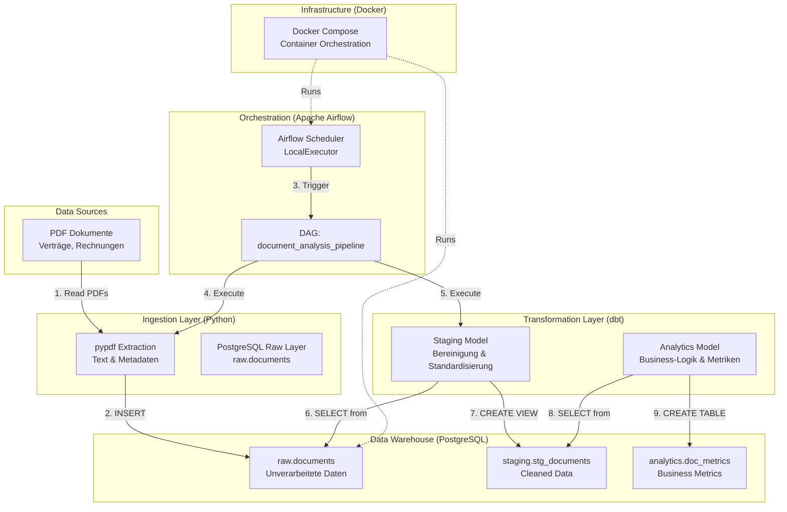

# Document Analysis & Management Pipeline

## Projektübersicht

Dieses Projekt demonstriert eine moderne, produktionsreife Datenpipeline für die **automatisierte Dokumentenanalyse** im Enterprise-Umfeld. Es wurde speziell als Portfolio-Projekt für Data/AI Engineering Rollen im DACH-Raum entwickelt und zeigt End-to-End Kompetenz in den Bereichen Data Ingestion, Transformation und Orchestrierung.

Die Pipeline verarbeitet unstrukturierte PDF-Dokumente, extrahiert Text und Metadaten mittels Python, speichert sie in einem PostgreSQL Data Warehouse und transformiert sie mit **dbt** (Data Build Tool) für analytische Zwecke. Der gesamte Workflow wird durch **Apache Airflow** orchestriert und folgt bewährten Data-Engineering-Prinzipien wie Idempotenz, Reproduzierbarkeit und Multi-Layer-Architektur (Raw → Staging → Analytics).

Das Projekt ist vollständig containerisiert mit Docker, um "Works on my machine"-Probleme zu vermeiden und eine einfache Deployment-Fähigkeit auf beliebigen Infrastrukturen (VPS, Cloud, On-Premise) zu gewährleisten. Es eignet sich ideal als Blaupause für reale Use Cases wie Vertragsanalyse, Rechnungsautomatisierung oder Compliance-Dokumentation.

## Architekturdiagramm



## Architektur & Tech Stack
- **Orchestrierung:** Apache Airflow (LocalExecutor für VPS-Optimierung)
- **Transformation:** dbt-core (Data Build Tool)
- **Datenbank:** PostgreSQL 15 (als Data Warehouse)
- **Extraktion:** Python (`pypdf` für PDF-Parsing)
- **Infrastruktur:** Docker & Docker Compose

## Pipeline Workflow
1. **Ingestion & Extraction (Python):** 
   - Generiert/Liest PDF-Dokumente.
   - Extrahiert Text, Seitenanzahl und Wortanzahl.
   - Lädt die Daten in den `raw` Layer (PostgreSQL).
2. **Orchestrierung (Airflow):** 
   - Triggered die Tasks, verwaltet Dependencies und stellt Retry-Logik sicher.
3. **Transformation (dbt):**
   - `stg_documents`: Bereinigt die Raw-Daten und standardisiert Formate.
   - `doc_metrics`: Berechnet Business-Metriken (z.B. durchschnittliche Wortlänge, Klassifikation als "Vertrag" via Keyword-Matching).

## Setup & Installation

### Voraussetzungen
- Docker & Docker Compose
- Git

### Schritte
```bash
# Repository klonen
git clone <deine-repo-url>
cd document-analysis-pipeline

# Umgebungsvariablen setzen (Standardwerte sind bereits in .env für Demo)
cp .env.example .env 

# Container bauen und starten
docker-compose up -d --build

# Airflow UI aufrufen
# URL: http://localhost:8080 (oder http://<VPS-IP>:8080)
# User: admin | Passwort: admin


